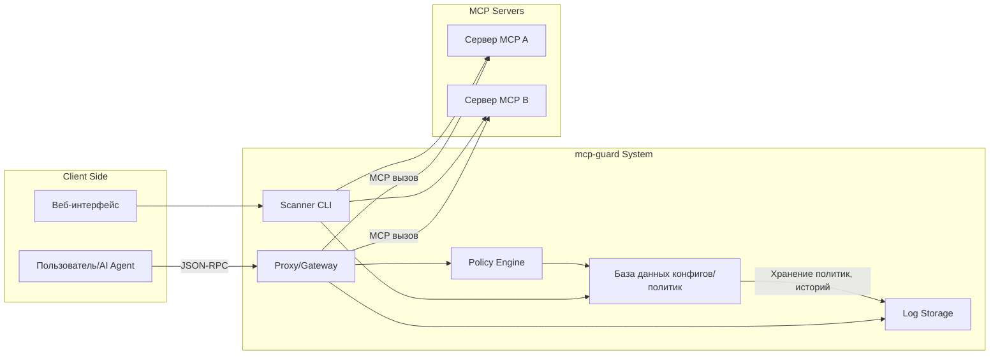
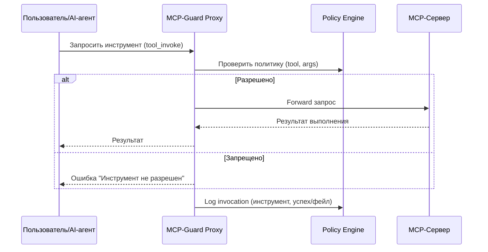

# Краткое резюме

MCP (Model Context Protocol) – это открытый протокол для интеграции больших языковых моделей (LLM) с внешними данными и инструментами【1†L97-L104】【21†L25-L33】. Он стандартизирует двустороннюю связь между AI-приложениями (хостами и агентами) и «серверами» MCP, которые предоставляют сервисы, функции (инструменты) и данные. С его помощью чат-боты и AI‑агенты могут запрашивать текущее состояние систем, вызывать API и выполнять реальные действия (например, запустить контейнер, сделать SQL-запрос, отправить e‑mail и т.д.). 

При всей полезности MCP появились новые уязвимости. OWASP сформулировал «Top 10» рисков MCP, куда входят такие атаки как **Tool Poisoning** (внедрение скрытых вредоносных инструкций в описание инструмента) и **Token Mismanagement** (утечка токенов)【3†L87-L91】【7†L7-L10】. Исследования Invariant Labs и др. продемонстрировали реальные атаки: например, вредоносный сервер MCP может заставить модель прочитать приватный ключ SSH или конфигурацию, спрятав инструкции в описании инструмента【6†L69-L78】【22†L223-L232】. Пользователь при этом видит лишь «белый» интерфейс и не подозревает об утечке. 

Предложенный проект – **безопасный шлюз и сканер для серверов MCP** – ориентирован на обнаружение и блокировку таких угроз. Мы предлагаем комбинированный подход: статический анализ описаний инструментов (сканирование MCP-серверов) и динамический прокси/прокладку (gateway), который будет контролировать выполнение вызовов в реальном времени по настраиваемым политиками. Система обеспечивает управление доступом (RBAC), журналирование (аудит) и интеграцию с системами CI/CD. Основная цель – дать DevOps/SecOps-инженерам инструмент для безопасного подключения AI-агентов к внутренним сервисам, учитывая требования OWASP MCP Top 10【3†L87-L91】【22†L223-L232】.

# Идеи названия проекта

Проекту нужно звучное английское имя, связанное с древней Грецией (символ защиты, страж, инструмент и т.д.). Пример нескольких вариантов:

| Название  | Происхождение      | Плюсы                                          | Минусы                                      | Доступность домена/GitHub (оценка)          |
|-----------|--------------------|-----------------------------------------------|---------------------------------------------|----------------------------------------------|
| **Argus** | Аргус – многоглазый сторож Ио у Геры. | Символ всевидящего контроля. Четко ассоциируется с надзором.  | Очень распространено в IT (Argus мониторинг, утилиты, проекты). Может быть занято. | argus.io занят, можно *ArgusGuard*, *ArgusMCP*. Проверить на github.com. |
| **Aegis** | Эгейда – щит Афины/Зевса.           | Ассоциируется с защитой и щитом. Короткое и запоминающееся.         | Часто используется в названии продуктов безопасности. Возможное совпадение с брендами. | Варианты: *AegisMCP*, *AegisGuard*. GitHub свободен?    |
| **Cerberus** | Цербер – трёхголовый пес подземного мира. | Надёжный страж, символ слежения в трех измерениях. Звучит грозно. | Довольно распространён (орехоукладчик Cerberus, музыкальные). Может показаться громоздким. | *CerberusGate*, *CerberusGuard*. Домен `cerberus` занят, но GitHub-проекты есть. |
| **Proteus** | Протей – морской бог, умеющий менять облик. | Символ гибкости и адаптивности. Подходит для «прокси» и трансляторов. | Возможно не очевидна связь с безопасностью. Уже существует Proteus (виртуализация FPGA). | `proteus` вероятно занят (есть Proteus Design Suite), но *ProteusProxy* или др. проверять. |
| **Aegis** | (повторно) – есть вариант **AegisShield** или **AegisGate**  |                                           |                                              |                                              |
| **Athena** | Афина – богиня мудрости.         | Интеллект и стратегия, подходит для аналитики.                        | Очень популярное имя (AWS Athena, Intel Athena). | Лучше избегать, чтобы не путаться с известными сервисами. |

*Примечание:* фактическая доступность домена или репозитория требуется проверить отдельно. В таблице приведены лишь предварительные оценки по известности имени. Желательно подобрать комбинированную форму (например, `ArgusGuard` или `AegisMCP`), если базовое слово занято. 

# Цели и целевые пользователи

**Цели проекта:** разработать открытый инструмент, который позволит командам безопасно внедрять и эксплуатировать MCP-сервера. Основные задачи:

- **Защита от атак MCP.** Обнаруживать и предотвращать угрозы по OWASP MCP Top 10 (скрытые инструкции, утечка токенов, утечки данных через контекст и т.д.)【3†L87-L94】【6†L69-L78】.  
- **Статический анализ (сканирование).** Проверять конфигурации и описания инструментов серверов MCP до их запуска в продакшн – обнаружение опасных фрагментов, уязвимостей и отклонений (расхождения) по политике.  
- **Динамическая защита.** Проксирование запросов от AI-агента к MCP-серверам с наложением политик (firewall): разрешено/запрещено вызывать определённые инструменты, отслеживать аргументы, предотвращать командные инъекции.  
- **Журналирование и аудит.** Собрать логи всех операций (вызовов, ошибок, сигнатур атак), чтобы обеспечить расшифровку инцидентов (MCP07: отсутствие аудита и телеметрии【3†L117-L122】).  
- **Интеграция в CI/CD.** Упрощённая проверка безопасности MCP в пайплайнах (например, GitHub Actions) для автоматического сканирования перед деплоем.  

**Целевые пользователи:** DevOps/SRE-инженеры, IT-безопасники и архитекторы AI-систем, которые разрабатывают или внедряют LLM-агентов в инфраструктуру организации. Например, команды в компаниях с внутренними системами (базы данных, файлообменники, сервисы через API), где нужно открыть AI доступ к этим ресурсам без риска компрометации критичных систем. Также полезно безопасности AI-стартапам, интегрирующим внешние MCP-сервера, и Open Source-сообществу, стремящемуся создать стандарты безопасности MCP.

# Основные возможности системы

Проект объединит две составляющие: **сканер безопасности MCP** и **прокси/шлюз (gateway)** с политиками. Ключевые фичи:

- **Сканер MCP-серверов:** CLI-инструмент и/или сервис, который подключается к указанному MCP-серверу (или множеству серверов), извлекает все зарегистрированные инструменты (MCP `tool`), их описания и ресурсы, и выполняет анализ описаний на наличие подозрительных инструкций (Tool Poisoning, скрытые ссылки, доступ к «/etc», `~/.ssh` и т.п.), проверяет консистентность версий (MCP Rug Pull) и соответствие политике.  
- **Политика безопасности:** Формальная спецификация (YAML/JSON) политик, описывающая, какие действия разрешены/запрещены для каждого MCP-сервера или инструмента. Например, можно задать шаблоны разрешенных API-запросов, белые списки директорий для файловых инструментов, ограничения на сетевые вызовы, списки разрешенных/запрещенных шаблонов в описаниях инструментов. Политики могут включать роли и метаданные (роль «Dev», «SecOps» и т.д.).  
- **Защитный прокси (gateway):** HTTP/STDIO-прокси между AI-клиентом (MCP-клиентом) и реальным MCP-сервером. При получении вызова инструмента прокси проверяет запрос по политике: блокирует подозрительные команды (например, `file.write` на запрещенную директорию), может «sandbox» (ограничивать исполнение, использовать контейнеры для изоляции серверов и инструментов), и логирует каждый вызов/результат. Также прокси может добавлять механизм подтверждения: если инструмент потенциально опасен, запросит ручное подтверждение от пользователя.  
- **Аудит и логирование:** Весь трафик MCP-протокола (вызовы инструментов, ответы, метаданные) записывается в централизованную систему логов/телеметрии. Предусмотрен экспорт в стандартные форматы (JSON, Elasticsearch, OpenTelemetry). Логи должны содержать информацию о пользователе/роли, сервере, инструменте, аргументах и результатах для последующего анализа.  
- **UI и CLI для администрирования:** Веб-панель (или TUI) для управления списком серверов, политиками, просмотра состояния (сканы, истории вызовов, тревоги). CLI-интерфейс (`mcp-guard` или подобное) для сканирования серверов, применения политик, быстрого просмотра отчетов. CLI пригодится для интеграции в скрипты и CI.  
- **Интеграция CI/CD:** В частности, готовый GitHub Action (или другая CI-пайплайн-механика) для запуска сканирования конфигурации MCP и соблюдения политики перед мерж-реквестами. Например, шаг `mcp-guard scan` в GitHub Actions может провалить сборку при обнаружении угроз. Это ускорит безопасную разработку новых интеграций.  

Эти возможности взаимно дополняют друг друга: сканер выявляет проблемы на этапе разработки/девелопмента, а прокси обеспечивает их предотвращение во время исполнения AI-агента. Обе части используют единый движок правил (policy engine) и хранилище.

# Подробные функциональные требования

## Сканер безопасности (Static Analyzer)

- **Запуск:** `mcp-guard scan [--config <файл>] [--server <URL>]`.  
- **Ввод:** Конфигурация MCP (локальный JSON-файл `mcp.json` с URL-адресами серверов и учетными данными) либо прямой указатель на MCP-сервер (хост:порт).  
- **Вывод:** Отчет (JSON/Pretty) со списком обнаруженных проблем: уязвимости, сигнатуры Tool Poisoning (в тексте описания инструмента), несоответствие политике, прочее.  
- **Функции:**  
  - Подключение к одному или нескольким MCP-серверам, запрос списка доступных инструментов.  
  - Скачивание описания каждого инструмента (метаданных: name, description, inputSchema, outputSchema).  
  - Анализ текста описания на наличие ключевых фраз (например, упоминание «~/.ssh», «token», «read/write»), проверка синтаксиса (валидность JSON-Schema, отсутствие запрета).  
  - Проверка неизменности инструментов (Tool Pinning / Rug Pull): сравнивать хэш текущего описания с ранее сохранённым в базе; если отличается после того, как инструмент был одобрен – выдавать тревогу.  
  - Отчет о конфигурационных проблемах (например, незашифрованные токены в параметрах, слишком широкие CORS-настройки, наличие встроенных скриптов).  
  - Совместимость с несколькими версиями MCP-протокола (например, `2024-12-25`, `2025-11-25`), если это имеет смысл.  

### UX-Flow для сканера

1. **Инициализация:** Администратор запускает `mcp-guard scan --config config.yaml`. Указывает файл config.yaml, где прописаны MCP-серверы и их креды.  
2. **Аутентификация:** Если сервер требует токен/логин, CLI использует указанные учетные данные.  
3. **Сбор данных:** Сканер запрашивает от каждого сервера список инструментов и их описаний (MCP JSON-RPC метод, например, `tool_list` или `tool_descriptions`).  
4. **Анализ:** Каждое описание инструмента прогоняется через статический анализ: проверяются подозрительные конструкции, сравниваются с политикой (если политика загружена), вычисляется хэш и сравнивается с базой.  
5. **Отчет:** После анализа сканер выводит список проблем: строки, в которых обнаружены потенциальные атаки. Может сгенерировать файл отчёта (JSON) и пометить CI-флагом (pass/fail).  

**Пример CLI-команд:**
```bash
mcp-guard scan --config mcp-servers.yml --report report.json
mcp-guard policy test --server https://mcp.example.com --tool file_reader --input '{"path":"/secret.txt"}'
```
Первой командой мы запускаем сканирование по настройкам. Второй – можем протестировать конкретный сценарий работы: пускать инструмент `file_reader` с аргументом через движок политики и посмотреть, что будет разрешено/заблокировано.

## Защитный шлюз (Proxy / Gateway)

- **Запуск:** В режиме сервера: запускается процесс-прокси, который слушает локальный порт и перенаправляет запросы AI-агента в указанный MCP-сервер, применяя политики по пути.  
- **Функции:**  
  - Поддержка протоколов MCP (обычно JSON-RPC по HTTP, SSE или STDIO).  
  - Чтение политик безопасности (YAML/JSON) с правилами для каждого сервера и инструмента.  
  - При получении запроса инструмента: проверка параметров, отмена запросов, если они нарушают политику (например, попытка записать в `/etc/passwd`).  
  - Внедрение ограничений: возможность подменять аргументы или останавливать выполнение по условию.  
  - Изоляция: опциональное исполнение инструментов внутри контейнера/sandbox-а (см. безопасность).  
  - Лимитирование ресурсов: настраиваемые timeout-и и квоты (например, максимальное время выполнения, памяти, запросов в секунду).  
  - Параметры аутентификации: поддержка JWT/OAuth для клиентов и серверов.  
  - Мониторинг: экспорт метрик (Prometheus) о количестве запросов, заблокированных вызовов, задержках.  

### Endpoints (примеры)

- `POST /proxy/<server-id>/tools/<tool-name>/invoke` – перевести вызов инструмента к MCP-серверу через прокси.  
- `GET /proxy/<server-id>/health` – статус шлюза.  
- `GET /audit/logs` – получение отфильтрованных логов аудита (в JSON).  
- `POST /policy/reload` – перезагрузить политики без перезапуска.  

(Это условные API; прототип может использовать чисто проксирование JSON-RPC без REST-обёртки.)

### UX-Flow прокси

1. **Конфигурация:** В админской UI или CLI задаём список MCP-серверов, настраиваем политики для каждого (какие инструменты разрешены, правила фильтрации параметров).  
2. **Запуск:** Прокси запускается, слушает, например, http://localhost:8000. AI-агент настраивается так, чтобы MCP-сервер `https://api.internal` проксировался через него (например, через заголовок X-Proxy-URL).  
3. **Вызов инструмента:** Пользователь (AI) инициирует `InvokeTool` через MCP-клиент. Запрос приходит в прокси.  
4. **Проверка политики:** Прокси сопоставляет запрос с набором правил. Если всё разрешено, запрос пересылается реальному серверу. Если обнаружено нарушение (например, tool name = `file_rw` и путь `/etc`), прокси возвращает ошибку.  
5. **Ответ:** Прокси возвращает агенту результат (или ошибку) и логирует событие.  

## Интерфейс и отчёты

- **CLI (`mcp-guard`).** Команды для сканирования (`scan`), тестирования политики (`policy test`), управления базой допустимых инструментов (`tool pin`, `tool unpin`), экспорта/импорта конфигурации. CLI выводит текстовые сообщения и возвращает коды ошибок, удобные для CI.  
- **Веб-интерфейс (опционально).** Дашборд с перечнем известных MCP-серверов, показом их статуса («в сети/потерян связь»), количества вызовов, ошибок и предупреждений. Раздел «Политики» с возможностью править правила. Раздел «Сканы» со списком последних сканирований и найденных уязвимостей.  
  
**Пример GitHub Actions snippet:** (Pseudo-конфигурация)

```yaml
- name: MCP Security Scan
  uses: user-org/mcp-guard-action@v1
  with:
    config: mcp_config.yaml
    policy: security-policy.yaml
```

Это действие скачивает конфигурацию MCP-серверов и политики из репозитория и запускает сканер, анализируя результаты. Если найдены проблемы, билд фейлится с описанием.

# Политика безопасности (Security Policy)

Политика описывается в формате YAML/JSON. Например:

```yaml
servers:
  internal-db:
    description: "База данных для отчетов"
    allow-tools: ["db_query", "file_reader"]
    deny-tools: ["file_writer", "shell_exec"]
    tool-policies:
      db_query:
        params:
          - name: query
            pattern: '^SELECT.*FROM reports'  # запрещаем DROP/DELETE и т.д.
      file_reader:
        path:
          allow:
            - "/data/reports/*"
          deny:
            - "/data/reports/secret/*"
    headers:
      - name: Authorization
        allow: false  # запрещаем проксировать авторизационные заголовки к этому серверу
rbac:
  roles:
    admin:
      can-manage: [servers, policies]
    dev:
      can-scan: [servers]
    auditor:
      can-view: [audit_logs, scan_reports]
```

В примере политика задаёт для сервера `internal-db` белый список инструментов и правила по параметрам (регулярные выражения, шаблоны путей). Также показана простая RBAC-схема. В реальном ТЗ необходима более формальная спецификация (например, JSON Schema для policy-файла).

# Безопасность и угроза

## Модель угроз

Основная угроза – **злоумышленный или скомпрометированный MCP-сервер**. Такой сервер может предоставить модели инструменты с вредоносными описаниями (Tool Poisoning), подтолкнуть к выполнению опасных команд (Command Injection) или ускользнуть из-под контроля (команда `!rm -rf /`). Другие угрозы:
- **Утечка токенов/секретов (MCP01).** Если прокси или сканер не блокируют в описании инструмента строки вроде `Bearer` или `token=`, конфиденциальные данные могут «заболтаться» в логи.  
- **Превышение полномочий (Privilege Creep, MCP02).** Без контроля scope-инструментов возможно накопление прав (например, право читать файловую систему может расшириться до возможности её изменения).  
- **Shadow Servers (MCP09).** Неавторизованные MCP-инстансы внутри сети, о которых админы не знают. Скринер может помогать их выявлять (сетевым сканированием конфигураций).  
- **Context Injection/Over-Sharing (MCP10).** Риски связаны с тем, что контекст одного пользователя/сессии может протечь в другой. Шлюз может обеспечивать логику «отделения контекстов» (не передавать все временные переменные дальше).  

## Механизмы защиты

- **Аутентификация и авторизация (RBAC).** Доступ к конфигурам и политике должен быть ограничен. LDAP/OAuth интеграция, JWT-токены для API прокси. MCP-серверы тоже могут требовать свои токены, которые хранятся безопасно (шифруются) в конфиге сканера/прокси.  
- **Минимизация полномочий (MCP principle of least privilege).** Инструменты должны получать только те привилегии, которые им действительно нужны. Политики статически определяют, какие аргументы им можно передать, а какие нет.  
- **Анализ и фильтрация описаний (против Tool Poisoning).** Сканер предупреждает, если в `description` или `promptTemplate` обнаружены теги `<IMPORTANT>` или слова вида “read SSH”, “private key” 【6†L69-L78】【22†L223-L232】. Прокси блокирует такие инструменты до одобрения админом.  
- **Изоляция (sandboxing).** При желании каждый MCP-сервер запускается в Docker-контейнере с ограничениями: read-only FS, ограничение CPU/MEM, drop-net (только разрешённый egress), секурные профили (например, Linux seccomp)【20†L199-L208】. Таким образом, если даже злоумышленник получит доступ через Tool Poisoning, он не сможет выйти из контейнера.  
- **Сканирование на попадание секретов.** Перед отправкой результатов в UI/CLI сканер и прокси должны маскировать известные чувствительные поля (пароли, ключи) и по возможности выполнять сканинг на наличие шаблонов секретов (MCP01).  
- **Логи и трассировка.** Подробные логи (инструмент, параметры, исход/результат) помогают при расследовании инцидентов. Логи должны храниться неизменяемо (append-only).  
- **Обновления безопасности и CI.** Автоматическое тестирование политик и патчей сканера/прокси с использованием примерного набора MCP-атак (на манер MCPTox【22†L223-L232】, заглушках инструментов).  

## Соответствие OWASP MCP Top 10

Проект адресует сразу несколько пунктов из MCP Top 10【3†L87-L94】:

- **MCP01 (Token Mismanagement & Secret Exposure):** Политики помогут избегать утечек секретов. Логирование и сканирование ищут токены в конфигурациях.  
- **MCP02 (Scope Creep):** Политики жёстко контролируют, какие действия разрешены. Никаких «специфичных прав» не будет предоставлено инструментам без явного правила.  
- **MCP03 (Tool Poisoning):** Главная цель – вылавливать и блокировать скрытые инструкции в описаниях инструментов【7†L7-L10】【6†L69-L78】.  
- **MCP05 (Command Injection):** Любые инструменты, выполняющие системные команды, должны иметь фильтрацию входа и запускаться в sandbox-окружении. Прокси должен проверять аргументы на инъекции (Escaping, Pattern).  
- **MCP07 (Insufficient AuthN/AuthZ):** Внедрение RBAC и аутентификации для всех компонентов (прокси, сканер, UI). Если прокси управляет несколькими серверами, используется механизм «Bearer token per server»【22†L223-L232】.  
- **MCP08 (Lack of Audit and Telemetry):** Вся активность должна логироваться. Система должна иметь возможность экспорта телеметрии (Prometheus/Grafana).  

Эти меры вместе обеспечат заметно более безопасное использование MCP в инфраструктуре.

# Архитектура решения

Предлагаемая система состоит из следующих компонентов:

- **Security Scanner (mcp-guard CLI):** однопользовательское приложение (или daemon), которое анализирует указанные MCP-сервера или конфиги. Хранит базу «подписанных»/проверенных версий инструментов и истории сканирования.  
- **Security Gateway (mcp-guard-proxy):** долгоживущий сервис (Web/API), который принимает трафик MCP от клиентов и транслирует на серверы. Реализован с возможностью масштабирования (например, несколько инстансов за балансировщиком).  
- **Policy Engine:** централизованная логика применения правил. Может быть отдельной библиотекой, используемой сканером и прокси.  
- **UI/Backend:** (при наличии) Веб-сервер с UI для управления серверами, политиками, просмотра логов и отчетов. Backend общается с базой данных.  
- **База данных:** Например, PostgreSQL или другой графово-реляционный DB для хранения конфигурации (список серверов, политики, ключи), истории сканов, токенов, логов аудита.  
- **Хранилище логов:** Elasticsearch/Kibana или аналогичный стек для хранения и визуализации логов и метрик.  
- **Инструмент CI (GitHub Action):** не обязательный компонент, но поставляется как пакетный runner, использующий CLI-сканер внутри CI.

**Диаграмма архитектуры (пример):**



**Режимы развертывания:**  
- **Локальный CLI/Dev:** Скэнер устанавливается на машине разработчика или в CI. Использует прямой доступ к конфигам и может запускаться через SSH/TLS к серверам.  
- **Agent-based:** Компактный агент (написанный на Go/Python) на стороне каждого MCP-сервера, собирает данные о состоянии и инструментах, пересылает на центральный сервер для анализа. (Упрощает работу в изолированных сетях.)  
- **Прокси (серверная часть):** Стационарное приложение (например, развернуто на сервере или в контейнере) с веб-интерфейсом и REST/JSON-RPC API. Может быть «on-premise» (отдельный продукт), либо SaaS (хостится у вендора), если это не запрещено политиками компании.  
- **SaaS Self-Hosted:** Предусмотрена как модель open source: любой может установить на собственную инфраструктуру (Docker-контейнеры, Kubernetes Helm-чарты). Опционально можно сделать hosted-версию (Software-as-a-Service) – но она не должна быть обязательной для работы.  

# API и форматы

## Пример запроса JSON-RPC через Proxy

```json
{
  "jsonrpc": "2.0",
  "id": 123,
  "method": "tool_invoke",
  "params": {
    "tool_id": "file_reader",
    "arguments": {
      "path": "/data/public/report.txt"
    }
  }
}
```
Прокси на стороне получает такой запрос, проверяет `tool_id` и `arguments` по правилам (вполне стандартный JSON). Если всё ОК, пересылает на реальный MCP-сервер.

## Пример формата политики (JSON Schema)

```json
{
  "servers": {
    "string": {
      "description": "Описание сервера",
      "allow-tools": ["string"], 
      "deny-tools": ["string"],
      "tool-policies": {
        "string": {
          "inputSchema": {},     // можно указать уточнения по входящим данным
          "outputSchema": {}
        }
      }
    }
  },
  "rbac": {
    "roles": {
      "string": {
        "can-manage": ["string"]
      }
    }
  }
}
```

Каждая часть политики валидируется по JSON Schema (встроено в system code).

# Хранилище и телеметрия

- **База данных:** Рекомендуется использовать реляционную БД (PostgreSQL) или документную (MongoDB) для хранения конфигураций и результатов сканирования. Таблицы/коллекции: Servers, Tools (c хэшами), Policies, ScanResults, AuditLogs, Users/Roles.  
- **Логи:** Прокси и сканер пишут структурированные логи JSON (дата/время, уровень, событие, детали). Лог может отправляться в stdout (для Docker) и/или сразу в систему сбора (ELK, Loki, Graylog).  
- **Метрики:** Экспортируется в формате Prometheus (количество запросов/сек, среднее время ответа, количество заблокированных вызовов). Это позволяет строить дашборды в Grafana и алёрты.  

# Стратегия тестирования

- **Unit-тесты:** Для каждого модуля: парсеры политик, валидаторы JSON, проверки правил (результат «разрешить/запретить» для набора кейсов). Особое внимание – угловые случаи (edge cases) парсинга JSON-RPC, сериализации/deserializacji.  
- **Integration-тесты:** Поднимаются реальные и фейковые MCP-серверы (например, на Python FastAPI или Go) с известными инструментами. Запускать сканер и прокси на них, проверять, что легитимные инструменты работают, а вредоносные – блокируются.  
- **Fuzzing:** Генерировать случайные («мутированные») описания инструментов с вложенным JSON, специальными символами, длинными текстами; смотреть, что сканер стабильно их обрабатывает и не падает.  
- **Red Team / Security Testing:** Разработать набор атакующих инструментов (имитировать TPA: сконструировать MCP-сервер с «заминированными» описаниями, см. MCPTox【22†L223-L232】). Проверять, что наш прокси и сканер их обнаруживают. Можно также привлекать внешних специалистов по инфобезу (bounty-program).  
- **Performance & Scalability:** Нагрузочные тесты прокси под высокой частотой вызовов и большим числом инструментов (например, 1000 инструментов). Контролировать время ответа и использование памяти.  
- **Regression testing:** При выходе новых версий MCP протокола (по аналогии с LSP) — запускать полные тесты сканера и прокси на предмет поддержания совместимости.

# План реализации и дорожная карта

**Версия 0.1 (MVP, 1–2 разработчика, 2–3 месяца):**  
- Реализовать CLI-сканер как отдельный инструмент. Поддержка чтения конфига `mcp.json` и одного сервера.  
- Функционал: загрузка инструментов, базовый анализ описаний (например, поиск ключевых слов «ssh», «token», «exec»), вывод отчёта.  
- Простая политика: YAML с white/black list инструментов по серверу.  
- GitHub Action: обёртка запуска сканера в CI.  
- Документация: README, примеры конфигов, шаблоны GitHub (ISSUE, PR).  

**Версия 0.2 (MVP+, 2–3 месяца):**  
- Доработка политики: расширение до правил параметров, путей, RBAC.  
- Прокси-сервис: базовый forwarding запросов MCP, с hook-ами проверки. Запись логов вызовов (в файл).  
- UI: веб-интерфейс из коробки (на Flask/Django+React или простом Htmx), показывающий список серверов и найденные проблемы.  
- Различные транспорты: поддержка HTTP и STDIO для прокси.  
- Тестирование: добавить integration-тесты.  

**Версия 1.0 (3–4 месяца после начала):**  
- Полноценная RBAC, аутентификация (OAuth2, JWT).  
- Поддержка HTTPS/TLS и авторизации (возможность задать публичный ключ сервера, проверку цепочки).  
- Сервисный режим с постоянной работой (служба в Linux).  
- Архитектура: контейнеризация (Dockerfile), Helm-чарт для Kubernetes, самодокументация API (OpenAPI).  
- Расширение анализа: интеграция с секрет-менеджером (косвенно обнаруживать фиктивные секреты), регулярные обновления правил (Threat Intel).  
- Обеспечение отказоустойчивости (многоинстансная федерация, если нужно).  

**Дальнейший рост (после 1.0):**  
- Интеграция с облачными платформами (AWS, GCP) – сканирование MCP-серверов в облаке.  
- Machine learning для обнаружения новых векторов атак (например, кластеризация необычных инструментов).  
- Партнёрства: поддержка популярных MCP-серверов (Zapier, Claude Desktop) и распространение как плагина для них.  

# Лицензирование и модель вклада

- **Лицензия:** Рекомендуется permissive-лицензия (Apache 2.0 или MIT). Apache 2.0 предпочтительна для безопасности (покрывает патенты).  
- **Вклад:** Стандартный workflow GitHub: issue-трекер, pull requests. Предусмотреть CONTRIBUTING.md с описанием процесса, CODE_OF_CONDUCT, шаблоны issue/PR.  
- **Библиотеки:** Open Source (можно использовать Rust/Python библиотеки для парсинга JSON, фреймворк для API). Все зависимости должны быть под совместимыми лицензиями (MIT, Apache).  
- **Release-модель:** Semantic versioning (v1.0.0 и далее). Регулярные выпускаемые сборки (npm/PyPI/Github Packages, DockerHub).  

# План маркетинга и поддержки сообщества

- **Документация и примеры:** Полная документация на сайте/вики, примеры policy-файлов, HOWTO установки. Перевод основных разделов на несколько языков (русский, английский).  
- **GitHub template:** README с описанием проекта, статус сборки (CI badges), контрибуционные инструкции. Issue templates для багов и фичереквестов.  
- **Сообщество:** Канал в Slack/Discord или форум для вопросов. Активное участие в OWASP MCP Top10, накачка репо (OSS: TravisCI или GitHub Actions, CodeCov, Dependabot).  
- **Webinars/Видео:** Показать работу системы на примерах атак (Tool Poisoning demo) – привлечёт внимание.  
- **Search и SEO:** Размещение статей в блогах, публикация на хабре/medium о безопасности MCP и нашем решении (со ссылками на GitHub).  
- **Партнёрства:** Упоминания в официальных гайдлайнах MCP (Anthropic), совместимость с проектами типа ContextForge (см. ниже).  
- **Распространение:** После релиза 1.0 можно анонсировать проект через AI- и SecOps-конференции (RSA, KubeCon), форумы сообществ (HackerNews, r/LocalLLaMA).  

# Сравнение с существующими решениями

На рынке уже появляются инструменты по управлению MCP: например, IBM ContextForge【15†L642-L650】 или PlexMCP【18†L93-L102】 фокусируются на федерации и удобстве подключения (единый эндпоинт для многих серверов). Invariant Labs выпустила **MCP-Scan**【17†L47-L55】 для поиска проблем с инструментами (Tool Poisoning, Rug Pull) – статический анализ. 

Наш проект отличается **акцентом на защиту**: мы объединяем статический сканер *и* динамический прокси/шлюз с политиками. В отличие от ContextForge, который задаёт политики в основном для трансформации и маршрутизации инструментов, наш фокус – безопасность. В отличие от MCP-Scan, мы добавляем реальное применение политики во время выполнения через прокси (не просто обнаруживаем проблемы, но и блокируем их). 

Таким образом, мы заполняем нишу «MCP Security Gateway»: интегрируемся с существующими MCP-экосистемами (можно использовать ContextForge в связке, либо работать автономно), но акцентируемся на угрозах и аудите.  

# Диаграмма последовательности (Sequence Diagram)



В этой последовательности видно, как при каждом вызове прокси проверяет, разрешён ли инструмент/действие, и либо пропускает запрос, либо возвращает ошибку. Логи заносятся в Audit.

# Вывод

Предложенное ТЗ описывает комплексную систему защиты для проектов, использующих MCP. Разработка потребует сочетания знаний в области DevOps (контейнеризация, CI/CD), безопасности (OWASP-подходы, анализ уязвимостей), а также понимания протокола MCP. Результатом должен стать зрелый open-source проект, который значительно упростит безопасную работу с AI-агентами и станет стандартом в индустрии.

**Источники:** спецификация MCP【1†L97-L104】【21†L25-L33】, OWASP Top 10 для MCP【3†L87-L94】, исследования по безопасности MCP (Invariant Labs【6†L69-L78】, MCPTox【22†L223-L232】), а также документы на подобные инструменты (ContextForge【15†L642-L650】, PlexMCP【18†L94-L103】, MCP-Scan【17†L47-L55】).