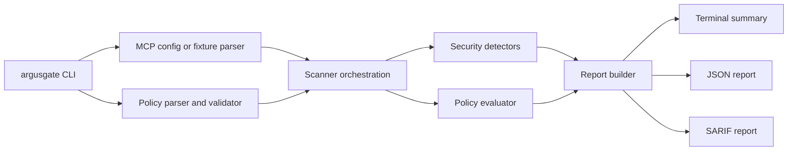

# Architecture

ArgusGate is currently a CLI-first Go project. The MVP is intentionally offline and file-based.

## Package Layout

- `cmd/argusgate`: CLI entrypoint.
- `argusgate/cli`: command parsing and exit-code handling.
- `argusgate/mcp`: MCP-like config and fixture parsers plus tool/server models.
- `argusgate/policy`: YAML policy parser, validator, policy findings, and exit decisions.
- `argusgate/scanner`: scan orchestration.
- `argusgate/scanner/detectors`: heuristic security detectors, split by detector family with stable rule metadata.
- `argusgate/scanner/severity`: severity ordering and threshold logic.
- `argusgate/report`: JSON report model, stable finding fingerprints, terminal summary renderer, and SARIF renderer.
- `argusgate/internal/redact`: secret redaction helpers.
- `argusgate/internal/fileio`: bounded regular-file reads and private atomic report writes.

## Data Flow

## MVP Runtime Behavior

The scanner reads size-bounded regular local files, validates server and tool shapes, applies detectors and policy rules, assigns stable finding fingerprints, applies policy suppressions, redacts secret-like evidence, atomically writes optional JSON and SARIF reports, and exits with a CI-friendly code.

It does not execute commands from MCP configs. It does not connect to external services. It does not call tools.

CLI output can be a text summary, JSON, or SARIF on stdout. JSON reports are generated from the same report model used for file output, so CI consumers receive the same fields regardless of output mode. SARIF output omits suppressed findings so reviewed risks do not create code scanning alerts.

## Detector Layout

Detectors are intentionally small and offline:

- tool poisoning: suspicious instructions, hidden markdown/HTML comments, encoded instructions, and invisible characters;
- secret exposure: token-like values, private-key placeholders, connection strings, authorization headers, and URL credentials;
- dangerous capability: shell, filesystem mutation, unrestricted file reads, network, browser automation, credentials, Docker/Kubernetes, cloud CLI, infrastructure-as-code, package manager, host administration, and database mutation capabilities;
- sensitive paths: host credential paths and sensitive file path segments;
- SQL risk: read-only and write/admin SQL signals.

The detector rule registry gives each rule a stable ID, severity, category, OWASP MCP mapping, and recommendation for reports and future integrations.

## Release Pipeline

The CI workflow verifies modules, runs race-enabled tests and vet, and builds the Linux CLI on pushes and pull requests. GitHub Actions are pinned to commit SHAs. The release workflow runs on version tags, repeats test and vet checks, cross-compiles static CLI binaries for Linux, macOS, and Windows, requires all six archives, generates `SHA256SUMS.txt`, and publishes a GitHub prerelease with the generated assets.

## Future Gateway Shape

The policy and report packages are kept separate so a future MCP proxy can reuse them. A runtime gateway would add transport support, invocation argument checks, audit logging, and enforcement decisions. That gateway is not implemented in the MVP.
