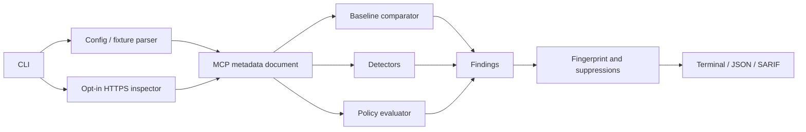

# Architecture

ArgusGate v0.3.0 is a CLI-first Go application. Local scans are offline; network access exists only behind the explicit `inspect` command or `--url` baseline source.

## Packages

- `cmd/argusgate`: process entrypoint.
- `argusgate/cli`: commands, flags, output paths, and exit codes.
- `argusgate/mcp`: bounded config/fixture parsing and MCP metadata models.
- `argusgate/inspection`: constrained HTTPS Streamable HTTP metadata client.
- `argusgate/baseline`: normalized contract hashing and drift findings.
- `argusgate/policy`: strict YAML parsing, precedence, suppressions, and exit decisions.
- `argusgate/scanner`: orchestration and finding limits.
- `argusgate/scanner/detectors`: focused heuristic detectors and rule metadata.
- `argusgate/rules`: stable public rule catalog.
- `argusgate/report`: JSON, terminal, fingerprints, and SARIF.
- `argusgate/internal/redact`: secret and terminal-output redaction.
- `argusgate/internal/fileio`: bounded reads and private atomic output writes.

## Data Flow

## Inspection Boundary

The inspector uses the official MCP Go SDK but wraps its HTTP transport with an allow list.

Allowed JSON-RPC methods:

- `initialize`
- `notifications/initialized`
- `tools/list`
- `prompts/list`
- `resources/list`
- `resources/templates/list`

The transport blocks tool calls, prompt retrieval, resource reads, redirects, retries, standalone SSE, cross-origin requests, non-HTTPS endpoints, credentials in URLs, and unexpected HTTP methods. Requests and responses have hard size limits, list pagination is bounded, and credentials are read from environment variables only.

## Baseline Model

A baseline contains:

- normalized server identity and contract hashes;
- tool, prompt, resource, and resource-template identity/contract hashes;
- protocol and ArgusGate format versions.

Environment/header values are omitted; only key names affect server contracts. Secret-like values elsewhere are redacted before hashing. Added and changed contracts are high severity; removal is informational.

## Determinism And Failure

Map traversal, artifact ordering, finding ordering, fingerprints, rule listing, reports, and baseline entries are sorted deterministically. Inputs, policies, metadata nesting, HTTP messages, per-response bytes, session-response bytes, pages, artifacts, and findings are bounded. Incomplete analysis creates unsuppressible critical `AG-SCAN001`.

## Deferred Runtime Gateway

The package boundaries allow future reuse by a runtime gateway, but v0.3.0 does not proxy MCP traffic or enforce tool invocations.
