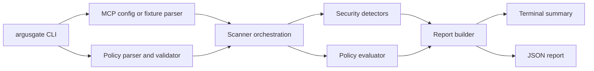

# Architecture

ArgusGate is currently a CLI-first Go project. The MVP is intentionally offline and file-based.

## Package Layout

- `cmd/argusgate`: CLI entrypoint.
- `argusgate/cli`: command parsing and exit-code handling.
- `argusgate/mcp`: MCP-like config and fixture parsers plus tool/server models.
- `argusgate/policy`: YAML policy parser, validator, policy findings, and exit decisions.
- `argusgate/scanner`: scan orchestration.
- `argusgate/scanner/detectors`: heuristic security detectors.
- `argusgate/scanner/severity`: severity ordering and threshold logic.
- `argusgate/report`: JSON report model and terminal summary renderer.
- `argusgate/internal/redact`: secret redaction helpers.

## Data Flow

## MVP Runtime Behavior

The scanner reads local files, parses server and tool metadata, applies detectors, applies policy rules, redacts secret-like evidence, writes an optional JSON report, and exits with a CI-friendly code.

It does not execute commands from MCP configs. It does not connect to external services. It does not call tools.

CLI output can be a text summary or JSON on stdout. JSON reports are generated from the same report model used for file output, so CI consumers receive the same fields regardless of output mode.

## Future Gateway Shape

The policy and report packages are kept separate so a future MCP proxy can reuse them. A runtime gateway would add transport support, invocation argument checks, audit logging, and enforcement decisions. That gateway is not implemented in the MVP.
